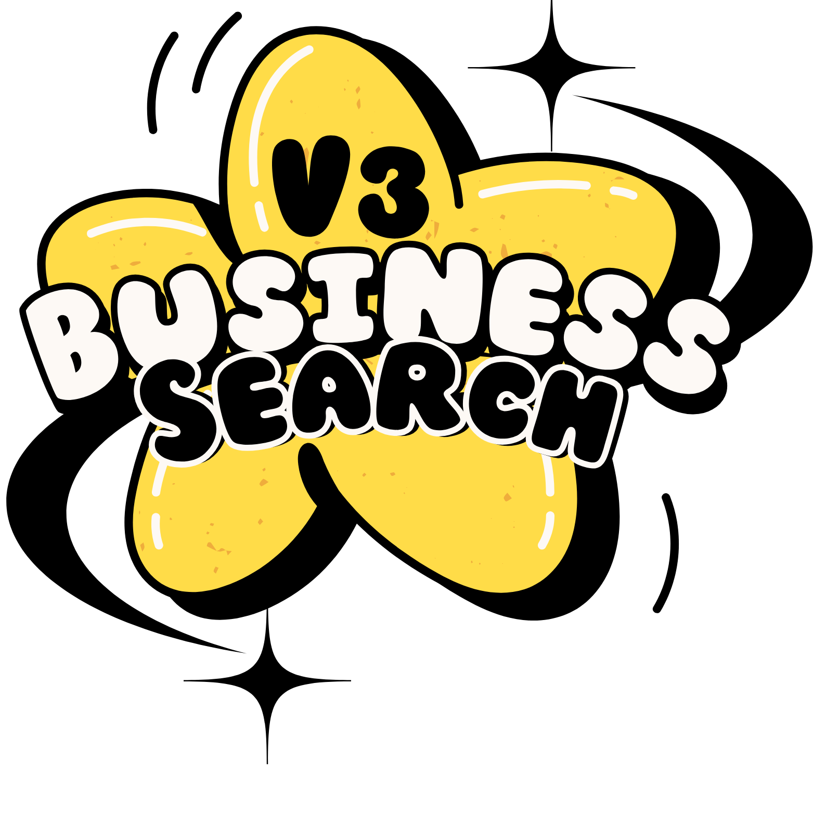

# V3 Business Search 🔍

<div align="center">
  
  
  ### Free SMB Lead Generation Tool
  Built by [WillyV3](https://www.linkedin.com/in/willyv3/) | Powered by [V3 AI](https://v3-ai.com)
  
  [](https://github.com/williavs)
  [](https://www.linkedin.com/in/willyv3/)
  [](https://v3-ai.com)
</div>

## 🚀 Overview

V3 Business Search is a free, streamlined tool for sales professionals to generate targeted SMB lead lists. Built with Streamlit and powered by V3 AI's data aggregation capabilities, it provides instant access to business information for local service providers and professionals.

### 📊 What You Get
- Business Names
- Website URLs
- Phone Numbers

### 🎯 Perfect For
- Sales Teams
- Lead Generation
- Market Research
- Local Business Outreach

## 🛠️ Features

### Quick Lists
- Industry-specific targeting
- Local business focus
- SMB-optimized results

### Data Points
- Business names
- Website URLs
- Phone numbers

### Export Ready
- CSV export
- Clay compatible
- Easy enrichment

## 📋 How to Use

1. **Select Target Industry**
   - Examples: dentists, plumbers, accountants
   - Focus on local service providers

2. **Specify Location**
   - Enter city and state
   - Format: "Seattle, WA"

3. **Choose Results Count**
   - Select 1-100 results
   - Keep under 100 for API courtesy

4. **Export & Enrich**
   - Download as CSV
   - Enrich with Clay or similar services

## ⚠️ Important Notes

- **Focus**: SMB data (not Fortune 500 or large enterprises)
- **Source**: Public web data
- **Enrichment**: Recommended to use [Clay](https://clay.com) for additional data
- **Limits**: Please keep searches under 100 results

## 🔧 Technical Setup

### Prerequisites
```bash
python 3.8+
pip
streamlit
```

### Installation
1. Clone the repository
```bash
git clone https://github.com/williavs/v3-business-search.git
cd v3-business-search
```

2. Install dependencies
```bash
pip install -r requirements.txt
```

3. Run the application
```bash
streamlit run app.py
```

## 🤝 Custom Solutions

Need more advanced features or custom integrations? V3 AI specializes in building enterprise-grade data tools:

- 🎯 Go-to-Market Intelligence
- 🔍 Lead Generation & Enrichment
- 📊 Market Research Automation
- 🤖 AI-Powered Data Processing
- 🔄 Workflow Automation

### Featured Projects
- [V3 AI Platform](https://v3-ai.com) - Enterprise AI Solutions
- [PM Feels](https://pmfeels.com) - Product Management Tools
- [Sagedoc](https://sagedoc.me) - AI Documentation

## 📄 License

This project is licensed under the MIT License - see the [LICENSE](LICENSE) file for details.

## 🙏 Acknowledgments

Built with ❤️ by [WillyV3](https://www.linkedin.com/in/willyv3/), founder of [V3 AI](https://v3-ai.com).

---

<div align="center">
  <p>© 2024 V3 AI | Created by William VanSickle III</p>
  <p>
    <a href="https://v3-ai.com">v3-ai.com</a> |
    <a href="https://github.com/williavs">GitHub</a> |
    <a href="https://www.linkedin.com/in/willyv3/">LinkedIn</a>
  </p>
</div> 